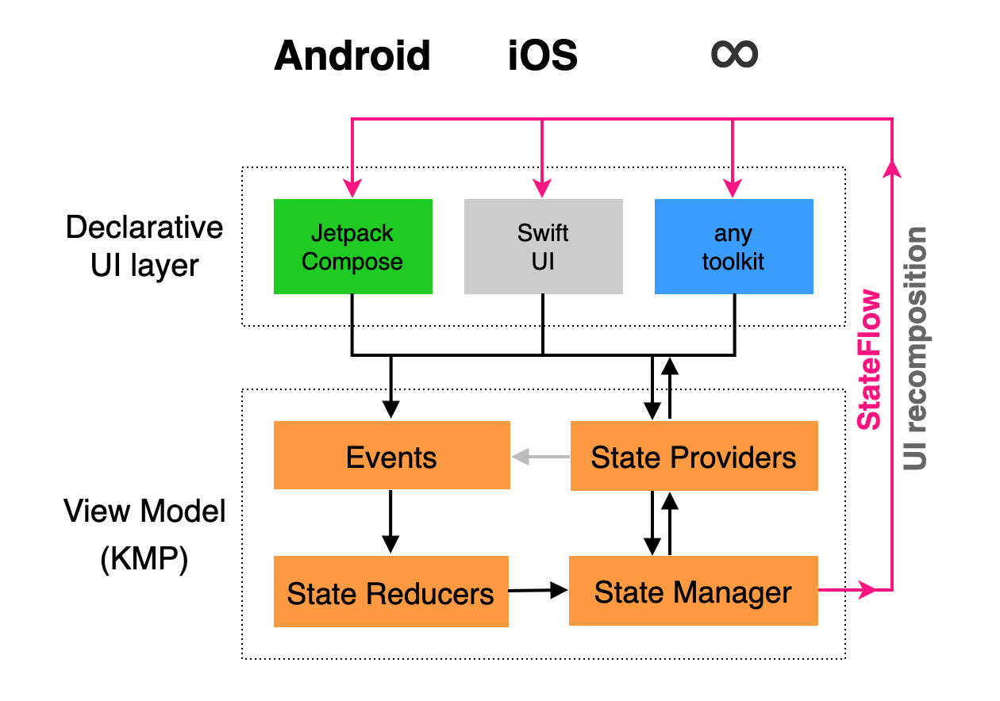
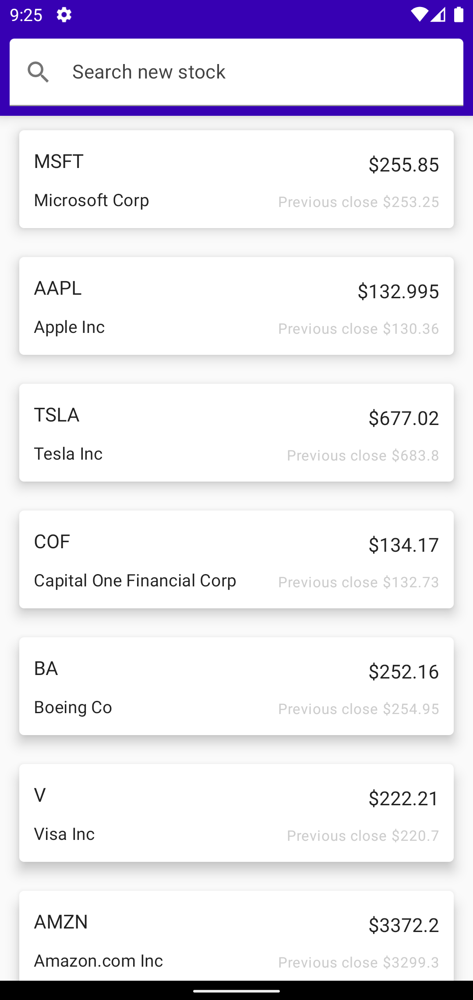
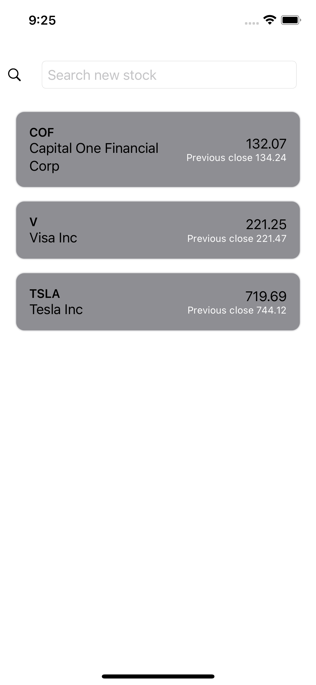

# KmmStonksApp - A Kotlin Multi Platform(Mobile) concept app

This is a proof of concept app built using Kotlin Multi Platform Mobile.
The app was created with [D-KMP architecture](https://danielebaroncelli.medium.com/the-future-of-apps-declarative-uis-with-kotlin-multiplatform-d-kmp-part-1-3-c0e1530a5343).
And makes an extensive use of shareable viewmodel/data layer between Android and iOS. This could also be integrated with web, but that is out of scope for this demo.

The app flow is:

1. User launches the application
1. Enters a new stock ticker or load pre-defined list.
1. Stock current price shows up in a card view.
1. Tapping on the card moves user to the detail view.

 

## Take away
Overall, I was very pleased with the result and amount of shared logic I was able to consolidate.
Tooling around this technology is still not mature, but I think future is bright for Kotlin Multi Platform.
